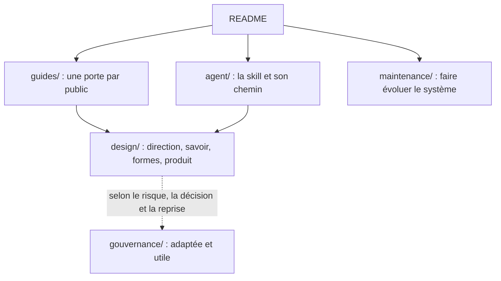

# Design Governance V1.0.0

Design Governance aide un agent, ou une personne, à concevoir des pages, des écrans et des identités visuelles qui ont une vraie direction, qui sont réellement construits et soignés dès la première proposition, puis à les améliorer en regardant le rendu. Quand un travail doit être livré ou audité, le système garde aussi la trace de ce qui a été vérifié, et de ce qui ne l’a pas été.

> **Statut :** expérimentation maintenue, pensée pour un usage avec revue humaine. Son effet sur la qualité des rendus n’est pas encore mesuré (`NOT-VERIFIED`).

## Par où entrer

| Vous êtes | Entrée | Ce que vous y trouvez |
|---|---|---|
| Débutant : vous voulez un résultat, sans apprendre le système | [`guides/commencer.md`](guides/commencer.md) | Quoi demander, quoi fournir, ce que vous recevrez, comment poursuivre |
| Designer | [`guides/designer.md`](guides/designer.md) | Où se trouve chaque sujet, comment combiner les capacités, quand s’arrêter |
| Équipe ou opérateur | [`guides/equipe.md`](guides/equipe.md) | Piloter un travail, le tracer et le livrer |
| Relecteur ou responsable | [`gouvernance/README.md`](gouvernance/README.md) | Ce qui a été prouvé, les limites, la clôture |
| Agent | [`agent/skill/SKILL.md`](agent/skill/SKILL.md) | Le noyau, puis quoi lire selon le chemin |
| Personne qui fait évoluer le système | [`maintenance/README.md`](maintenance/README.md) | Distributions, validation, versions |

Le vocabulaire est expliqué dans [`guides/glossaire.md`](guides/glossaire.md).

## Installer la skill dans un agent

La skill ne contient que le noyau ; ses routes, ses scripts et ses schémas restent dans le paquet. Gardez donc le paquet entier, puis :

1. **Rendre la skill visible.** Avec Claude Code, copiez le dossier `agent/skill` sous le nom `design-governance-practice`, dans `.claude/skills/` du projet ou dans `~/.claude/skills/` (par exemple `cp -r agent/skill .claude/skills/design-governance-practice`). Avec un autre agent, donnez-lui `SKILL.md` comme instructions.
2. **Donner accès au paquet.** Les commandes de la skill (`python3 scripts/read_route.py …`) s’exécutent depuis la racine du paquet : travaillez dans ce dossier, ou indiquez son chemin à l’agent (« Design Governance est dans /chemin/du/paquet ; lance ses scripts depuis ce dossier »). Python 3.10 ou plus récent suffit ; la recette de rendu demande aussi Playwright et Chromium.
3. **Vérifier.** Depuis la racine du paquet, `python3 scripts/read_route.py DIRECTION/START` affiche la route.

Sans accès au paquet, l’agent n’a que le noyau. Après une mise à jour du paquet, recopiez la skill. Le noyau commun active la ligne du mode et les détails au moment utile ; un détail marqué « noyau » dans sa source n’est pas nécessairement embarqué dans la skill.

<!-- constitution:début -->
## Les cinq règles essentielles

Quel que soit le travail, cinq règles priment :

1. **Une surface d’identité doit avoir une direction visible.** Être conforme (contraste, états, focus, performance) est un plancher, pas un résultat.
2. **Une direction d’identité s’appuie sur une ancre** : une référence observée, ou fournie pour un produit réel. On peut explorer sans ancre, à condition de le dire.
3. **Rien n’est livré sans les vérifications qui s’appliquent.**
4. **Avant d’agir, on déclare** le chemin suivi, la décision principale, le risque principal, la vérification minimale et le moment où l’on s’arrête.
5. **Pas de beauté hors sol.** Le produit, la tâche visée, les contraintes et les preuves font partie du design : le réel et le beau sont cadrés ensemble.

Une conformité de surface ne vaut ni direction visible, ni preuve d’usage, ni qualité réelle. Ces règles résument [la direction de design](design/direction/standard.md#les-cinq-règles-absolues), qui fait foi ; elles ne remplacent pas les règles détaillées du design, du produit ou de la gouvernance.
<!-- constitution:fin -->

## Comment ça marche

Deux boucles se répondent. La première **crée** : cadrer le produit et son public, chercher des références quand elles peuvent changer la décision, choisir une direction, construire une scène complète, polir. La seconde **apprend** : regarder le rendu réel, nommer le défaut principal, corriger, regarder à nouveau, décider. Le détail est dans [`design/README.md`](design/README.md).

## Ce que contient le dépôt



| Partie | Chemin | Contenu |
|---|---|---|
| **Guides** | `guides/` | Les portes : commencer, designer, équipe, glossaire. |
| **Design** | `design/` | Le cœur : direction, savoir, formes, qualité du produit. |
| **Agent** | `agent/` | La skill (`agent/skill/`), le chemin de l’agent et sa réponse. |
| **Gouvernance** (selon le besoin) | `gouvernance/` | Contrôles et trace adaptés au risque, à la décision et aux besoins de reprise ; schémas et outils de validation. |
| **Maintenance** | `maintenance/` | Faire évoluer le système : distributions, validation, versions. |
| **Sections conservées** | `V1/sections/` | Sections conservées et carte dérivée ; les sections déplacées gardent la même autorité. |
| **Outils** | `scripts/` | Lecteur, contrôles et construction des distributions. |

La gouvernance s'adapte au travail : chaque contrôle et chaque élément de trace doit aider à vérifier une affirmation, protéger un risque, permettre une reprise ou préparer une acceptation. Une proposition exploratoire garde une trace légère ; un travail persistant, partagé, audité ou soumis à acceptation conserve les éléments formels nécessaires. Les preuves applicables restent dues.

Les guides orientent ; ils ne créent aucune règle. Une règle fait foi dans sa section propriétaire, à son emplacement actuel, décrit dans le [sommaire des sources](V1/sections/README.md). Les codes historiques et les adresses lisibles désignent les mêmes sections.

Pour lire une seule partie du système :

```bash
python3 scripts/read_route.py --sommaire            # toutes les sections et leur rôle
python3 scripts/read_route.py savoir/couleur        # une section, par son adresse
python3 scripts/read_route.py --trouver "contraste" # chercher un terme
```

Ajoutez `--guides` pour chercher aussi dans les guides. Une recherche sans résultat ne prouve pas que la notion manque : reformulez.

## Limites

- **Version.** V1.0.0, révision `R2026-10-10-PRATIQUE` : voir le [journal des versions](maintenance/versions.md) et les [notes de version](RELEASE_NOTES.md).
- **Efficacité non vérifiée** (`NOT-VERIFIED`). Aucune mesure comparative ne montre encore l’effet du système sur la qualité des rendus. Usage recommandé : un pilote, avec revue humaine. Les preuves de CI hébergée, distinctes de cette efficacité, sont rattachées aux commits testés dans les [notes de version](RELEASE_NOTES.md#contrôles-inclus).
- **Une validation confirme seulement les contrôles exécutés.** Une capture prouve un rendu, pas un usage : à elle seule, elle ne prouve ni une tâche utilisateur, ni un lecteur d’écran, ni la sécurité, la performance ou une intégration réelle.
- **Séduisant n’est pas prouvé, conforme n’est pas réussi.** Le système demande de rendre cet écart visible et de corriger le défaut principal, sans le compenser par une autre preuve. Une étape ou une référence qui ne change rien est retirée.
- **Le système ne remplace** ni le jugement créatif, ni les tests utilisateurs, ni la responsabilité du projet. Toute conclusion dit ce qui a été observé, comment, sur quel périmètre et avec quelle limite.
