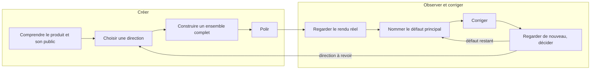

# Design — le cœur du système

Tout ce qui sert à décider, savoir, construire et finir un design de qualité professionnelle. La [gouvernance](../gouvernance/README.md) s’adapte au risque, à la décision et aux besoins de reprise : trace légère pour explorer, formalisation nécessaire pour un travail persistant, partagé, audité ou soumis à acceptation. Chaque élément ajouté doit être utile ; les preuves applicables restent dues.

| Dossier | Ce qu’on y trouve |
|---|---|
| `direction/` | Décider ce que la page doit être : [cadrer](direction/cadrer.md), [diriger](direction/diriger.md), [premier objet](direction/premier-objet.md), [la boucle](direction/boucle.md), [le standard](direction/standard.md) |
| [`savoir/`](savoir/README.md) | Le savoir de référence : fondements, qualité créative, typographie, composition, images, styles, contexte, techniques, goût |
| [`formes/`](formes/README.md) | Les structures : choisir une structure, catalogue des formes |
| [`produit/`](produit/README.md) | Ce qui fait un vrai produit : premier rendu, plancher, finition, preuve visuelle, interface |

Ces fichiers reprennent des sections des anciennes sources (`DIRECTION.md`, `SAVOIR.md`, `BIBLIOTHEQUE.md`, `ACTION.md`) ; leurs anciennes adresses restent valables.

## Créer puis apprendre

Le système fait travailler deux boucles qui se répondent : l’une crée, l’autre observe et corrige.

| Créer | Observer et corriger |
|---|---|
| Comprendre le produit et son public. | Mesurer ce qui est en jeu et choisir le chemin de travail. |
| Chercher des références quand elles peuvent changer la décision. | Dire ce qui est concerné et ce qu’il faudra vérifier. |
| Ouvrir plusieurs pistes, puis choisir une direction adaptée au projet. | Protéger les contraintes qui ne se négocient pas. |
| Composer et construire un ensemble complet, avec les images, ressources et composants utiles. | Regarder le rendu réel et ses limites. |
| Polir sans confondre finition et décoration. | Nommer le défaut principal, corriger, regarder de nouveau, décider. |

La seconde boucle ne se résume pas à une critique écrite. Quand une décision créative est en jeu, elle suit la boucle d’édition : observer le rendu, nommer le défaut principal, modifier l’artefact, comparer, décider (voir [la boucle](direction/boucle.md)).

Pour les défauts de finesse, le noyau de la skill relie chaque symptôme à un geste possible (bord éclairé, alignement optique, chiffres stables, recadrage, regroupement) et à ce qu’il faut regarder de nouveau. Ces gestes se déclenchent selon le cas ; ils ne s’appliquent pas à tous les rendus. Les [formes](formes/README.md) relient de même une intention à un levier de construction et à son effet attendu : proportions, distances, typographie, cadrage, états. Ce n’est ni un catalogue de styles, ni une bibliothèque de composants prêts à l’emploi.

La trace dit ce qui a changé, ce qui n’a pas été vérifié et ce qui vient ensuite. Une preuve technique ne vaut pas jugement esthétique ; une intention créative ne cache pas une preuve d’usage ou d’accessibilité manquante. L’effet de ces gestes sur des travaux réels reste à mesurer.
